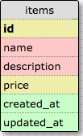

# Online Shoppe

## User Stories

- A user can see the list of products that are being sold.
- A user can enter new products.
- A user can manage and view products already in the system.
- A user does not need to log in to access information.

## Schema screenshot

-

## Installation Notes

Important down the road for listing development dependencies.

## Deployment details and link

- [Online shopping](https://floating-mesa-97764.herokuapp.com/)

## iteration 2

Have a quantity in stock for each item and a price.
Prices should be displayed in legit format $99.95
Have a separate view for inventory administration (add, remove, edit) located at '/admin'. Use http_basic_authenticate_with_name. Username should be admin and password is secret. Also have this protection for item creation, edit, and deletion.
UX for inventory view should be tabular, very functional, designed to help the merchant move through lots of data quickly
UX for the shopper's view should be visual, maybe a grid of product images, should encourage spending time and slow browsing. The links to edit, delete, etc on each product should be hidden in the shopper's view
Beautiful, usable, responsive layout. The site should look decent on a mobile device. You can use SCSS or Sass for your stylesheets. Utilize the Bootstrap CSS framework.
Include flash error and success messages. Add styles Green for good and Red for bad.
